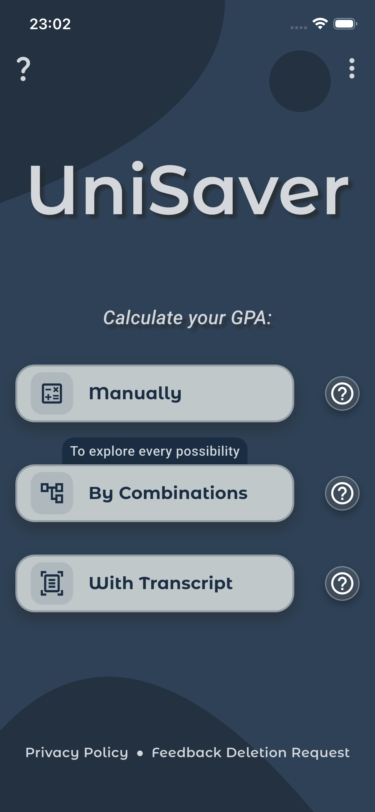
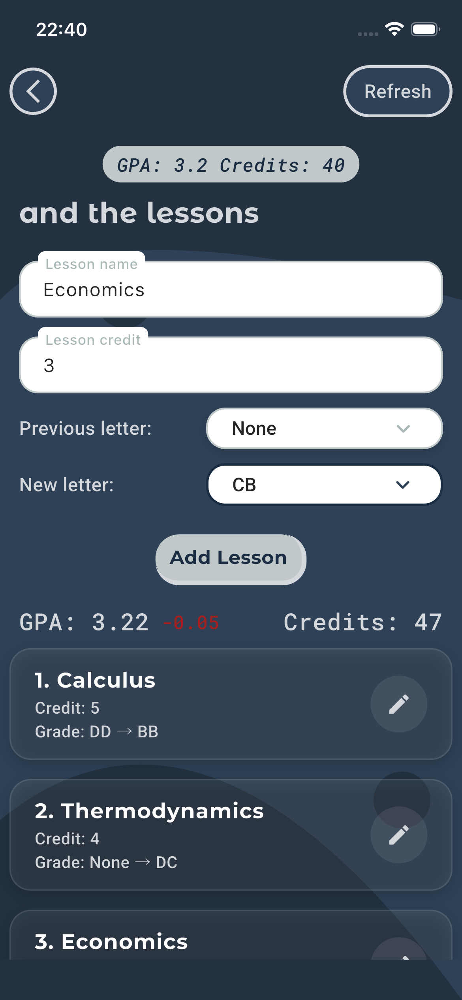
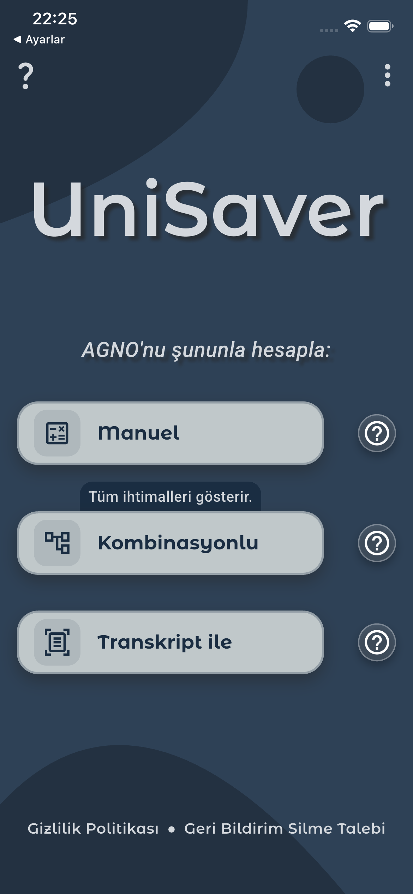
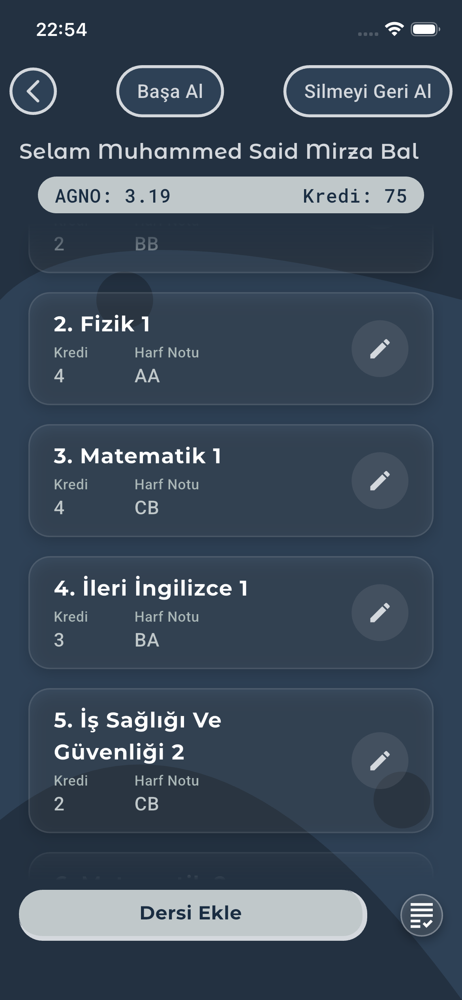
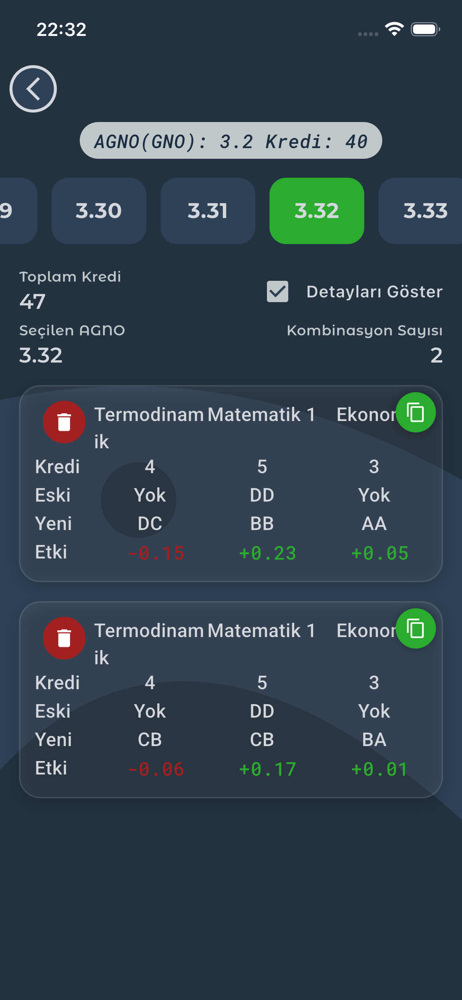

<div align="center">

  
  
  # UniSaver: Smart GPA Calculator & Planner
  
  **Calculate, Plan, Succeed.**
  
  [](https://flutter.dev/)
  [](https://dart.dev/)
  [](https://flutter.dev/docs/development/platform-integration/platform-channels)
  [](./LICENSE)

  <p align="center">
    <a href="#english">English</a> •
    <a href="#türkçe">Türkçe</a>
  </p>

  <a href="https://apps.apple.com/tr/app/unisaver/id6757317963">
    
  </a>
  <a href="https://play.google.com/store/apps/details?id=com.unisaver.unisaver">
    
  </a>

</div>

---

<div id="english"></div>

## 🇬🇧 English

**UniSaver** is not just a GPA calculator; it's a comprehensive academic planning assistant designed for university students. Built with **Flutter**, it leverages advanced algorithms to help students plan their graduation path, calculate necessary grades for target GPAs, and manage their transcripts efficiently.

### ✨ Key Features

* **📄 PDF Transcript Integration:** Automatically parses and imports courses/grades from university transcripts (supports e-Devlet PDF format).
* **🎲 Smart Probability Algorithm:** Calculates the exact grade combinations needed to achieve a target GPA.
* **📊 Scenario Planning:** Create "What If" scenarios for future semesters to see how different outcomes affect your cumulative GPA.
* **💾 Local & Secure:** Uses **Hive** and **SQLite** for robust local data persistence. Your academic data stays on your device.
* **🌍 Multi-Language Support:** Full support for English and Turkish (Localization via `l10n`).
* **⚡ State Management:** Built with scalable **Bloc/Cubit** architecture for seamless performance.
* **📱 Modern UI/UX:** Responsive design compatible with diverse screen sizes (`sizer`), featuring Dark Mode support.

### 📸 Screenshots

| Home & Dashboard | Transcript Import | Combination Calc | Manual Entry |
|:---:|:---:|:---:|:---:|
|  |  |  |  |

---

<div id="türkçe"></div>

## 🇹🇷 Türkçe

**UniSaver**, sadece bir not ortalaması hesaplayıcısı değil; üniversite öğrencileri için tasarlanmış kapsamlı bir akademik planlama asistanıdır. **Flutter** ile geliştirilen bu uygulama, öğrencilerin mezuniyet hedeflerine ulaşmaları için gereken notları hesaplayan ve transkript yönetimini kolaylaştıran gelişmiş algoritmalar kullanır.

### ✨ Öne Çıkan Özellikler

* **📄 PDF Transkript Entegrasyonu:** e-Devlet üzerinden alınan transkript PDF'lerini otomatik olarak okur, dersleri ve notları saniyeler içinde içe aktarır.
* **🎲 Akıllı Olasılık Algoritması:** Hedeflediğiniz ortalamaya ulaşmak için hangi derslerden hangi harf notlarını almanız gerektiğini hesaplar (Kombinasyon Hesabı).
* **📊 Senaryo Planlama:** Gelecek dönemler için "Ya Şöyle Olursa?" senaryoları oluşturarak ortalamanızın nasıl etkileneceğini görün.
* **💾 Yerel ve Güvenli:** Verileriniz **Hive** ve **SQLite** kullanılarak tamamen cihazınızda saklanır. Buluta veri göndermez, gizliliğinizi korur.
* **🌍 Çoklu Dil Desteği:** Türkçe ve İngilizce dil desteği (Localization).
* **⚡ Mimari:** Ölçeklenebilir ve temiz kod yapısı için **Bloc/Cubit** mimarisi ile geliştirilmiştir.
* **📱 Modern Arayüz:** Farklı ekran boyutlarıyla uyumlu (`sizer`), Karanlık Mod (Dark Mode) destekli şık tasarım.

### 📸 Ekran Görüntüleri

| Ana Sayfa | Transkript Yükleme | Kombinasyon Hesabı | Manuel Hesaplama |
|:---:|:---:|:---:|:---:|
|  |  |  |  |

---

## 🛠 Tech Stack & Libraries

* **Framework:** Flutter (Dart)
* **State Management:** `flutter_bloc`, `provider`
* **Database:** `hive`, `sqflite` (via helpers)
* **PDF Processing:** `syncfusion_flutter_pdf`
* **Backend/Cloud:** Firebase (Analytics, Functions)
* **Ads:** `google_mobile_ads`
* **UI Utilities:** `sizer`, `lottie`, `google_fonts`

## 🚀 Installation

1.  Clone the repo:
    ```bash
    git clone [https://github.com/unpronohoney/unisaver_flutter.git](https://github.com/unpronohoney/unisaver_flutter.git)
    ```
2.  Install dependencies:
    ```bash
    flutter pub get
    ```
3.  Run the app:
    ```bash
    flutter run
    ```

## 👨‍💻 Developer

**Mirza Bal** - *Industrial Engineer & Mobile Developer*

* [LinkedIn](https://www.linkedin.com/in/mirza-bal-msmb)
* [GitHub](https://github.com/unpronohoney)
* [Email](mailto:bamisamu@hotmail.com)
